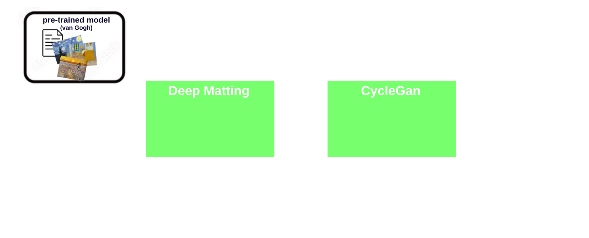

# IMX_Final_project
### Project Context and Objectives
For a detailed overview of the project's objectives, please refer to the explanatory video available at: https://www.youtube.com/watch?v=18-ueMDp4iQ&ab_channel=杜克

### Overall architecture
As outlined in the video presentation, our project leverages the combined power of DeepMatting and CycleGAN (refer to the section Additional Resources for in-depth information). The following description provides insights into how these technologies collaborate to fulfill our project goals:

### Key features
The primary functionalities of our project encompass the extraction of a foreground or any specified region from an image. Subsequently, the chosen style transfer is applied selectively—either exclusively on the extracted region or conversely on everything else, excluding the specified area. Our system supports a variety of pre-defined styles, with the flexibility to train for additional styles as needed.

# Additional ressources
## For CycleGAN
- CycleGAN paper+code: https://junyanz.github.io/CycleGAN/
- We used this CycleGAN open source project: https://github.com/junyanz/pytorch-CycleGAN-and-pix2pix/tree/master
- Pretrained models : https://efrosgans.eecs.berkeley.edu/cyclegan/pretrained_models/  
and script to download them automatically https://github.com/junyanz/pytorch-CycleGAN-and-pix2pix/blob/master/scripts/download_cyclegan_model.sh
- Relevant styles (6 pretrained models):  
summer2winter_yosemite, winter2summer_yosemite, style_monet, style_cezanne, style_ukiyoe, style_vangogh

# How to run the project
## On google colab
- First make sure to be connected to a GPU
- About the choice of the image to test our project: please chose an image with a human person on it and some background. The best results are with portraits of people. Please, name the image you have chosen 'image.jpg'. 
- Then run the following commands:
  
> ! git clone https://github.com/PhylibhertBINGLEY/IMX_Final_project 

> import os 

> os.chdir('IMX_Final_project/')
>
> *after running the previous command line, put the image of your choice at the root of the 'IMX_Final_project/' folder, and make sure to have named the image "image.jpg"*

> ! pip install ultralytics 

> ! pip install cvzone 

> *available models are summer2winter_yosemite, winter2summer_yosemite, style_monet, style_cezanne, style_ukiyoe, style_vangogh* 
>
> ! python3 main.py image.jpg --pretrained_model summer2winter_yosemite

